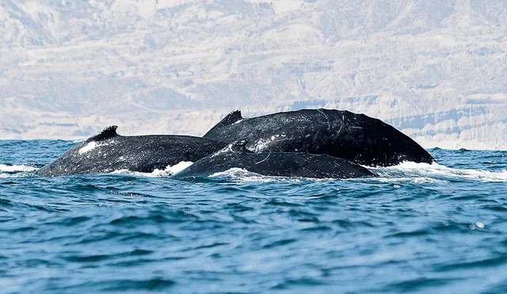

<!-- Generated file by make generate-readme. DO NOT EDIT. -->
# El Ñuro

A tool to get more information about your ~~whales~~ docker images.



Source: https://larepublica.pe

## Getting started

```console
Get more information about your docker images

Usage:
  nuro [command]

Available Commands:
  completion  Generate the autocompletion script for the specified shell
  created     Shows the creation date for a given image
  help        Help about any command
  labels      Shows labels for a given image

Flags:
  -h, --help                help for nuro
      --log-level string    Sets the log level (default "error")
      --netrc-file string   Read .netrc from file location, has precedence over --netrc-stdin
      --netrc-stdin         Read .netrc from stdin

Use "nuro [command] --help" for more information about a command.
```

## Install

### Using Go

```console
go install github.com/jcchavezs/nuro@latest
```

## References

- <https://peru.info/en-us/tourism/blogperu/3/48/experience-the-pacific-whalewatching-season>
- <https://github.com/opencontainers/distribution-spec/blob/main/spec.md>
